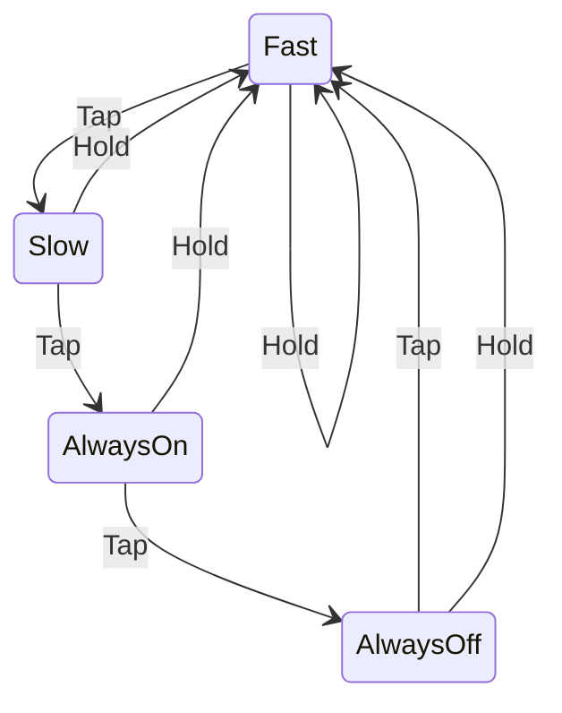

# Blinky Carl

Carl's version of a blinky project.

Features:

* Pulls needed Embassy crates from GitHub. *This is a temporary measure until the crates are published to crates.io.*
* Fully asynchronous.
* Implements a state machine with an `Enum` and one-function-per state.

## State Machine

If you tap the button, the LED will transition from fast, to slow, to always on, to always off, and back to fast.

If you hold the button, the LED will go straight back to fast.

